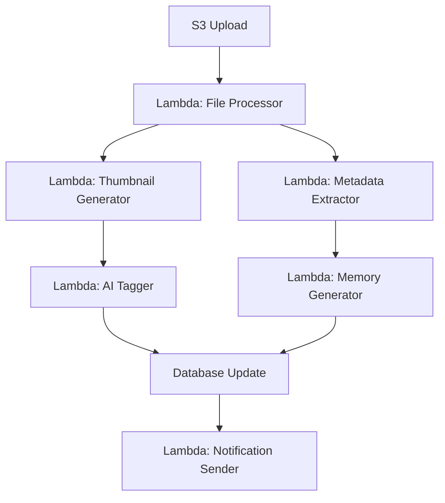

# AWS Lambda Integration Strategy

## 🎯 Overview
Maximize the use of AWS Lambda for serverless computing across PhotoVault to achieve better scalability, cost efficiency, and maintenance simplicity.

## 📋 Lambda Use Cases

### Current Lambda Applications
- **Image Processing**: Thumbnail generation and image optimization
- **Video Processing**: Video thumbnail extraction and format conversion
- **Metadata Extraction**: EXIF, GPS, and file analysis
- **Background Jobs**: Cleanup tasks and batch processing

### Extended Lambda Applications
- **AI/ML Processing**: Photo tagging, face detection, object recognition
- **Memory Generation**: Automated memory creation based on algorithms
- **Search Indexing**: Elasticsearch/OpenSearch document processing
- **Notification System**: Email/SMS notifications for shares and memories
- **File Validation**: Virus scanning and content moderation
- **Analytics Processing**: User behavior and storage analytics
- **Backup Operations**: Cross-region backup automation

## 🏗️ Technical Architecture

### Lambda Functions Structure
```
lambdas/
├── image-processing/
│   ├── thumbnail-generator/
│   ├── image-optimizer/
│   └── metadata-extractor/
├── video-processing/
│   ├── thumbnail-extractor/
│   └── format-converter/
├── ai-services/
│   ├── photo-tagger/
│   ├── face-detector/
│   └── object-recognizer/
├── memory-engine/
│   ├── memory-generator/
│   └── location-clusterer/
├── utilities/
│   ├── file-validator/
│   ├── cleanup-service/
│   └── notification-sender/
└── api-handlers/
    ├── auth-handler/
    ├── file-handler/
    └── search-handler/
```

### Event-Driven Architecture


## 📝 Sub-Tasks

### Phase L1: Core Lambda Functions
- [ ] **Image Processing Lambda**
  - Thumbnail generation (small, medium, large)
  - Image optimization and compression
  - Format conversion (HEIC to JPEG, etc.)
  - EXIF data extraction

**Effort:** 1 week
**Priority:** High

- [ ] **Video Processing Lambda**
  - Video thumbnail extraction
  - Video metadata extraction
  - Video compression for web streaming
  - Duration and quality analysis

**Effort:** 1 week
**Priority:** High

- [ ] **File Validation Lambda**
  - Virus scanning integration
  - Content type validation
  - File size and format checks
  - Malicious content detection

**Effort:** 3 days
**Priority:** Medium

### Phase L2: AI/ML Lambda Functions
- [ ] **AI Photo Tagging Lambda**
  - AWS Rekognition integration
  - Custom object detection
  - Scene recognition
  - Activity detection

**Effort:** 1 week
**Priority:** Medium

- [ ] **Face Detection Lambda**
  - Face recognition and clustering
  - Person identification
  - Face encoding generation
  - Similarity matching

**Effort:** 1.5 weeks
**Priority:** Medium

- [ ] **Smart Search Lambda**
  - Elasticsearch indexing
  - Semantic search processing
  - Search result ranking
  - Query optimization

**Effort:** 1 week
**Priority:** Low

### Phase L3: Memory & Analytics Lambda
- [ ] **Memory Generation Lambda**
  - Date-based memory creation
  - Location clustering algorithms
  - Event detection logic
  - Memory quality scoring

**Effort:** 2 weeks
**Priority:** Medium

- [ ] **Analytics Processing Lambda**
  - User behavior tracking
  - Storage usage analytics
  - Performance metrics
  - Cost optimization insights

**Effort:** 1 week
**Priority:** Low

- [ ] **Backup & Maintenance Lambda**
  - Cross-region backup automation
  - Old file cleanup
  - Database maintenance tasks
  - Health check monitoring

**Effort:** 1 week
**Priority:** Low

## 🔧 Implementation Details

### Lambda Configuration
```yaml
# lambda-config.yml
image-processor:
  runtime: nodejs18.x
  memory: 1024MB
  timeout: 300s
  triggers:
    - s3:ObjectCreated
  environment:
    S3_BUCKET: ${aws:s3:bucket:name}
    SHARP_CACHE_SIZE: 100

video-processor:
  runtime: nodejs18.x
  memory: 2048MB
  timeout: 600s
  triggers:
    - s3:ObjectCreated
  layers:
    - ffmpeg-layer

ai-tagger:
  runtime: python3.9
  memory: 512MB
  timeout: 180s
  triggers:
    - dynamodb:stream
  environment:
    REKOGNITION_REGION: us-east-1
```

### Deployment Strategy
- **Serverless Framework**: For Lambda deployment and management
- **AWS SAM**: For local testing and debugging
- **Lambda Layers**: Shared dependencies (Sharp, FFmpeg, ML models)
- **Dead Letter Queues**: Error handling and retry logic
- **CloudWatch**: Monitoring and alerting

### Cost Optimization
- **Memory Optimization**: Right-size memory allocation
- **Execution Time**: Optimize code for faster execution
- **Provisioned Concurrency**: For critical functions
- **Reserved Capacity**: For predictable workloads

## 🧪 Testing Strategy

### Unit Testing
- Lambda function logic testing
- Mock AWS services
- Error handling scenarios
- Performance benchmarks

### Integration Testing
- End-to-end workflow testing
- S3 trigger testing
- Database integration
- Cross-service communication

### Load Testing
- Concurrent execution limits
- Memory usage under load
- Timeout handling
- Cost impact analysis

## 📊 Monitoring & Observability

### CloudWatch Metrics
- Function duration and memory usage
- Error rates and retry counts
- Concurrent executions
- Custom business metrics

### X-Ray Tracing
- Request flow visualization
- Performance bottleneck identification
- Service map generation
- Error root cause analysis

### Alerting
- Function failures and timeouts
- High memory usage alerts
- Cost threshold warnings
- Performance degradation

## 🚀 Migration Strategy

### Phase 1: New Features
- Implement new features as Lambda functions
- Event-driven architecture for new workflows
- Serverless-first approach

### Phase 2: Existing API Migration
- Gradually move API endpoints to Lambda
- API Gateway integration
- Database connection pooling

### Phase 3: Complete Serverless
- Remove EC2/container dependencies
- Full Lambda-based architecture
- Cost optimization review

## 💰 Cost Analysis

### Estimated Monthly Costs
- **Image Processing**: ~$5-15/month (1000 images)
- **Video Processing**: ~$10-25/month (100 videos)
- **AI Services**: ~$15-30/month (AWS Rekognition)
- **Memory Generation**: ~$2-5/month (background jobs)
- **Total Lambda Costs**: ~$30-75/month

### Cost Optimization
- Use Lambda free tier (1M requests/month)
- Optimize memory allocation
- Implement efficient batching
- Use spot instances for non-critical tasks

## 🔗 Related Features

- [Terraform Infrastructure](./28-terraform-infrastructure.md) - Infrastructure as Code
- [GitHub Actions CI/CD](./29-github-actions.md) - Deployment pipeline
- [Image Optimization](./25-image-optimization.md) - Performance optimization
- [AI Tagging](./10-ai-tagging.md) - Machine learning integration
