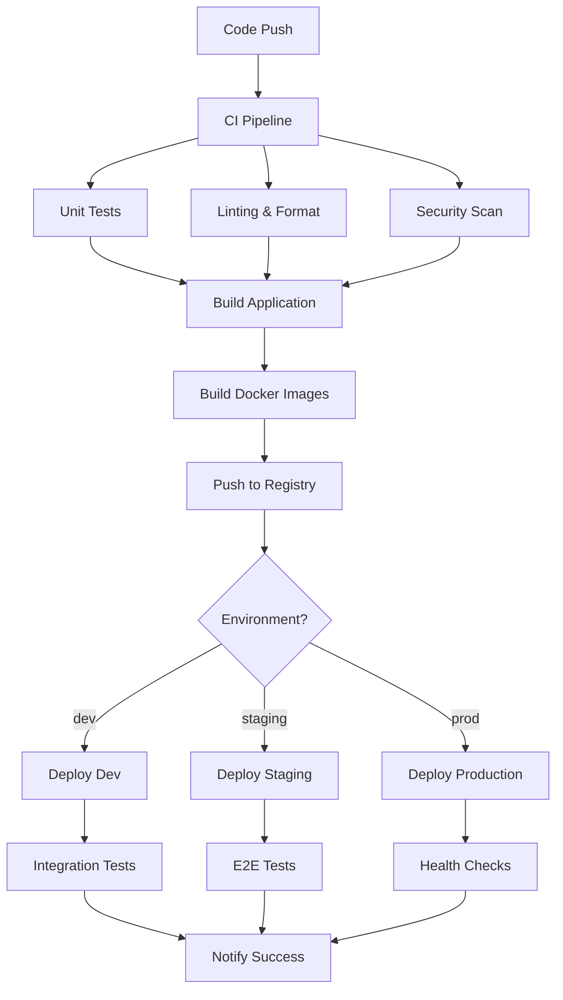

# GitHub Actions CI/CD Pipeline

## 🎯 Overview
Implement a comprehensive CI/CD pipeline using GitHub Actions for automated testing, building, and deployment of PhotoVault across multiple environments with infrastructure provisioning.

## 📋 Requirements

### Functional Requirements
- **Automated Testing**: Unit tests, integration tests, and security scans
- **Multi-Environment Deployment**: Dev, staging, and production environments
- **Infrastructure Deployment**: Terraform-based infrastructure provisioning
- **Docker Container Management**: Build and deploy containerized applications
- **Database Migrations**: Automated database schema updates
- **Rollback Capability**: Quick rollback to previous versions
- **Notification System**: Slack/Discord integration for deployment status

### Non-Functional Requirements
- **Security**: Secrets management and vulnerability scanning
- **Performance**: Parallel job execution and caching
- **Reliability**: Retry mechanisms and error handling
- **Monitoring**: Deployment metrics and health checks
- **Compliance**: Code quality gates and approval workflows

## 🏗️ Pipeline Architecture

### Workflow Structure
```
.github/
├── workflows/
│   ├── ci.yml                    # Continuous Integration
│   ├── cd-dev.yml               # Development Deployment
│   ├── cd-staging.yml           # Staging Deployment
│   ├── cd-production.yml        # Production Deployment
│   ├── infrastructure.yml       # Terraform Infrastructure
│   ├── security-scan.yml        # Security and Vulnerability Scans
│   ├── dependency-update.yml    # Automated Dependency Updates
│   └── cleanup.yml              # Environment Cleanup
├── actions/
│   ├── setup-node/
│   ├── deploy-lambda/
│   ├── run-tests/
│   └── notify-slack/
└── templates/
    ├── issue-template.md
    └── pr-template.md
```

### Pipeline Flow


## 📝 Sub-Tasks

### Phase CI1: Core CI Pipeline
- [ ] **Continuous Integration Workflow**
  - Code quality checks (ESLint, Prettier)
  - Unit and integration tests
  - Security vulnerability scanning
  - Docker image building
  - Artifact publishing

**Effort:** 3 days
**Priority:** High

- [ ] **Testing Automation**
  - Frontend unit tests (Jest, React Testing Library)
  - Backend unit tests (Jest, Supertest)
  - Integration tests with test database
  - Coverage reporting and thresholds

**Effort:** 4 days
**Priority:** High

- [ ] **Security and Quality Gates**
  - Code security scanning (CodeQL, Snyk)
  - Dependency vulnerability checks
  - License compliance verification
  - Code coverage enforcement

**Effort:** 2 days
**Priority:** High

### Phase CI2: Infrastructure Pipeline
- [ ] **Terraform CI/CD**
  - Infrastructure validation and planning
  - Multi-environment deployment
  - State management and locking
  - Drift detection and remediation

**Effort:** 4 days
**Priority:** High

- [ ] **Lambda Deployment Pipeline**
  - Serverless function packaging
  - Layer management and deployment
  - Environment variable management
  - Blue-green deployment strategy

**Effort:** 3 days
**Priority:** Medium

- [ ] **Database Migration Pipeline**
  - MongoDB connection validation
  - Migration testing in staging
  - Production migration with rollback
  - Data integrity verification

**Effort:** 3 days
**Priority:** Medium

### Phase CI3: Advanced Deployment
- [ ] **Container Orchestration**
  - ECS/Fargate deployment
  - Load balancer configuration
  - Auto-scaling setup
  - Health check implementation

**Effort:** 5 days
**Priority:** Medium

- [ ] **Monitoring and Alerting**
  - CloudWatch integration
  - Application performance monitoring
  - Error tracking and alerting
  - Deployment success metrics

**Effort:** 3 days
**Priority:** Medium

- [ ] **Feature Flag Integration**
  - Feature toggle management
  - Gradual rollout capability
  - A/B testing infrastructure
  - Rollback automation

**Effort:** 4 days
**Priority:** Low

## 🔧 Implementation Examples

### Main CI Workflow
```yaml
# .github/workflows/ci.yml
name: Continuous Integration

on:
  push:
    branches: [ main, develop ]
  pull_request:
    branches: [ main, develop ]

env:
  NODE_VERSION: '18'
  REGISTRY: ghcr.io
  IMAGE_NAME: ${{ github.repository }}

jobs:
  test:
    runs-on: ubuntu-latest
    strategy:
      matrix:
        node-version: [18, 20]
    
    services:
      mongodb:
        image: mongo:7
        env:
          MONGO_INITDB_ROOT_USERNAME: root
          MONGO_INITDB_ROOT_PASSWORD: password
          MONGO_INITDB_DATABASE: photovault_test
        options: >-
          --health-cmd "mongosh --eval 'db.adminCommand(\"ping\")'"
          --health-interval 10s
          --health-timeout 5s
          --health-retries 5
        ports:
          - 27017:27017

    steps:
      - name: Checkout code
        uses: actions/checkout@v4

      - name: Setup Node.js
        uses: actions/setup-node@v4
        with:
          node-version: ${{ matrix.node-version }}
          cache: 'npm'

      - name: Install dependencies
        run: |
          npm ci
          cd frontend && npm ci
          cd ../backend && npm ci

      - name: Run linting
        run: |
          npm run lint:frontend
          npm run lint:backend

      - name: Run type checking
        run: |
          npm run type-check:frontend
          npm run type-check:backend

      - name: Setup test database
        env:
          MONGODB_USERNAME: root
          MONGODB_PASSWORD: password
        run: |
          cd backend
          npm run test-connection

      - name: Run tests
        env:
          MONGODB_USERNAME: root
          MONGODB_PASSWORD: password
          JWT_SECRET: test-secret
        run: |
          npm run test:frontend
          npm run test:backend

      - name: Upload coverage reports
        uses: codecov/codecov-action@v3
        with:
          file: ./coverage/lcov.info
          flags: unittests

  security-scan:
    runs-on: ubuntu-latest
    steps:
      - name: Checkout code
        uses: actions/checkout@v4

      - name: Run security audit
        run: |
          npm audit --audit-level moderate
          cd frontend && npm audit --audit-level moderate
          cd ../backend && npm audit --audit-level moderate

      - name: Run Snyk security scan
        uses: snyk/actions/node@master
        env:
          SNYK_TOKEN: ${{ secrets.SNYK_TOKEN }}
        with:
          args: --severity-threshold=high

      - name: Initialize CodeQL
        uses: github/codeql-action/init@v2
        with:
          languages: javascript

      - name: Perform CodeQL Analysis
        uses: github/codeql-action/analyze@v2

  build:
    needs: [test, security-scan]
    runs-on: ubuntu-latest
    outputs:
      image-digest: ${{ steps.build.outputs.digest }}
    
    steps:
      - name: Checkout code
        uses: actions/checkout@v4

      - name: Log in to Container Registry
        uses: docker/login-action@v3
        with:
          registry: ${{ env.REGISTRY }}
          username: ${{ github.actor }}
          password: ${{ secrets.GITHUB_TOKEN }}

      - name: Extract metadata
        id: meta
        uses: docker/metadata-action@v5
        with:
          images: ${{ env.REGISTRY }}/${{ env.IMAGE_NAME }}
          tags: |
            type=ref,event=branch
            type=ref,event=pr
            type=sha,prefix={{branch}}-

      - name: Build and push Docker image
        id: build
        uses: docker/build-push-action@v5
        with:
          context: .
          push: true
          tags: ${{ steps.meta.outputs.tags }}
          labels: ${{ steps.meta.outputs.labels }}
          cache-from: type=gha
          cache-to: type=gha,mode=max
```

### Infrastructure Deployment Workflow
```yaml
# .github/workflows/infrastructure.yml
name: Infrastructure Deployment

on:
  push:
    paths:
      - 'infrastructure/**'
    branches:
      - main
      - develop
  workflow_dispatch:
    inputs:
      environment:
        description: 'Environment to deploy'
        required: true
        default: 'dev'
        type: choice
        options:
          - dev
          - staging
          - prod

jobs:
  terraform-plan:
    runs-on: ubuntu-latest
    strategy:
      matrix:
        environment: [dev, staging, prod]
    
    steps:
      - name: Checkout code
        uses: actions/checkout@v4

      - name: Setup Terraform
        uses: hashicorp/setup-terraform@v3
        with:
          terraform_version: 1.6.0

      - name: Configure AWS credentials
        uses: aws-actions/configure-aws-credentials@v4
        with:
          aws-access-key-id: ${{ secrets.AWS_ACCESS_KEY_ID }}
          aws-secret-access-key: ${{ secrets.AWS_SECRET_ACCESS_KEY }}
          aws-region: us-east-1

      - name: Terraform Init
        working-directory: infrastructure/environments/${{ matrix.environment }}
        run: terraform init

      - name: Terraform Plan
        working-directory: infrastructure/environments/${{ matrix.environment }}
        run: |
          terraform plan \
            -var-file=terraform.tfvars \
            -out=tfplan \
            -no-color

      - name: Upload Terraform Plan
        uses: actions/upload-artifact@v4
        with:
          name: tfplan-${{ matrix.environment }}
          path: infrastructure/environments/${{ matrix.environment }}/tfplan

  terraform-apply:
    needs: terraform-plan
    runs-on: ubuntu-latest
    if: github.ref == 'refs/heads/main' || github.event_name == 'workflow_dispatch'
    environment: 
      name: ${{ matrix.environment }}
      url: ${{ steps.deploy.outputs.url }}
    
    strategy:
      matrix:
        environment: [dev, staging, prod]
    
    steps:
      - name: Checkout code
        uses: actions/checkout@v4

      - name: Setup Terraform
        uses: hashicorp/setup-terraform@v3
        with:
          terraform_version: 1.6.0

      - name: Configure AWS credentials
        uses: aws-actions/configure-aws-credentials@v4
        with:
          aws-access-key-id: ${{ secrets.AWS_ACCESS_KEY_ID }}
          aws-secret-access-key: ${{ secrets.AWS_SECRET_ACCESS_KEY }}
          aws-region: us-east-1

      - name: Download Terraform Plan
        uses: actions/download-artifact@v4
        with:
          name: tfplan-${{ matrix.environment }}
          path: infrastructure/environments/${{ matrix.environment }}

      - name: Terraform Init
        working-directory: infrastructure/environments/${{ matrix.environment }}
        run: terraform init

      - name: Terraform Apply
        id: deploy
        working-directory: infrastructure/environments/${{ matrix.environment }}
        run: |
          terraform apply tfplan
          echo "url=$(terraform output -raw frontend_url)" >> $GITHUB_OUTPUT
```

### Lambda Deployment Workflow
```yaml
# .github/workflows/deploy-lambda.yml
name: Deploy Lambda Functions

on:
  push:
    paths:
      - 'lambdas/**'
    branches:
      - main
  workflow_dispatch:

jobs:
  deploy-lambdas:
    runs-on: ubuntu-latest
    strategy:
      matrix:
        function: 
          - image-processor
          - video-processor
          - ai-tagger
          - memory-generator
    
    steps:
      - name: Checkout code
        uses: actions/checkout@v4

      - name: Setup Node.js
        uses: actions/setup-node@v4
        with:
          node-version: '18'
          cache: 'npm'

      - name: Configure AWS credentials
        uses: aws-actions/configure-aws-credentials@v4
        with:
          aws-access-key-id: ${{ secrets.AWS_ACCESS_KEY_ID }}
          aws-secret-access-key: ${{ secrets.AWS_SECRET_ACCESS_KEY }}
          aws-region: us-east-1

      - name: Install dependencies
        working-directory: lambdas/${{ matrix.function }}
        run: npm ci --production

      - name: Package Lambda function
        working-directory: lambdas/${{ matrix.function }}
        run: |
          zip -r function.zip . -x "*.git*" "node_modules/.cache/*" "*.md"

      - name: Deploy Lambda function
        working-directory: lambdas/${{ matrix.function }}
        run: |
          aws lambda update-function-code \
            --function-name photovault-${{ matrix.function }}-${{ github.ref_name }} \
            --zip-file fileb://function.zip

      - name: Update function configuration
        working-directory: lambdas/${{ matrix.function }}
        run: |
          aws lambda update-function-configuration \
            --function-name photovault-${{ matrix.function }}-${{ github.ref_name }} \
            --environment Variables="{NODE_ENV=${{ github.ref_name }},LOG_LEVEL=info}"
```

## 🧪 Testing Strategy

### Automated Testing Levels
- **Unit Tests**: Individual function and component testing
- **Integration Tests**: API and database integration testing
- **E2E Tests**: Full user journey testing with Playwright
- **Performance Tests**: Load testing with Artillery
- **Security Tests**: OWASP ZAP security scanning

### Test Environment Management
- **Ephemeral Environments**: PR-based preview environments
- **Data Seeding**: Consistent test data across environments
- **Cleanup Automation**: Resource cleanup after testing
- **Parallel Execution**: Matrix builds for faster feedback

## 🚀 Deployment Strategies

### Progressive Deployment
- **Blue-Green Deployment**: Zero-downtime deployments
- **Canary Releases**: Gradual traffic shifting
- **Feature Flags**: Runtime feature control
- **Rollback Automation**: Quick reversion capability

### Environment Promotion
- **Development**: Automatic deployment on merge
- **Staging**: Manual approval with automated testing
- **Production**: Tagged releases with change approval

## 📊 Monitoring and Observability

### Pipeline Metrics
- **Build Success Rate**: Track deployment reliability
- **Deployment Frequency**: Measure development velocity
- **Lead Time**: Time from commit to production
- **Mean Time to Recovery**: Incident response speed

### Notification System
```yaml
# Slack notification example
- name: Notify Slack on failure
  if: failure()
  uses: 8398a7/action-slack@v3
  with:
    status: failure
    channel: '#deployments'
    webhook_url: ${{ secrets.SLACK_WEBHOOK }}
```

## 💰 Cost Optimization

### GitHub Actions Optimization
- **Matrix Strategy**: Parallel job execution
- **Caching**: Dependencies and build artifacts
- **Conditional Execution**: Skip unnecessary jobs
- **Self-Hosted Runners**: For cost-sensitive workloads

### Resource Management
- **Cleanup Workflows**: Remove unused resources
- **Scheduled Jobs**: Off-peak infrastructure updates
- **Resource Tagging**: Cost allocation and tracking

## 🔗 Related Features

- [Terraform Infrastructure](./28-terraform-infrastructure.md) - Infrastructure as Code
- [AWS Lambda Integration](./27-aws-lambda-integration.md) - Serverless deployment
- [Monitoring & Observability](./30-monitoring.md) - System monitoring
- [Security & Compliance](./31-security.md) - Security automation
